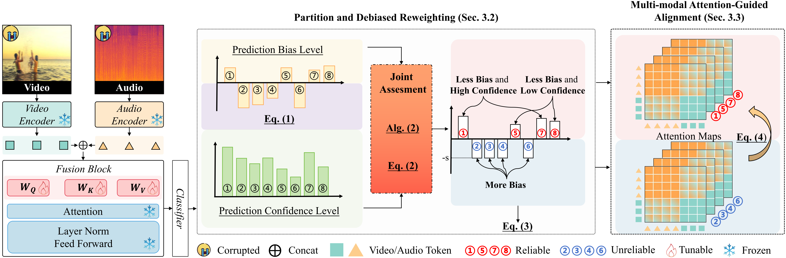

# Partition-Then-Adapt: Combating Prediction Bias for Reliable Multi-Modal Test-Time Adaptation
This repository contains the official implementation of the proposed PTA (NeurIPS-2025-spotlight).
## Overview
PTA addresses the practical and challenging task of **Multi-Modal Test-Time Adaptation (MM-TTA)**, where multiple modalities experience simultaneous corruption during deployment.
## Framework
[](Framework.png)
> **PTA first partitions the online data into two subsets, and jointly evaluates sample importance considering their prediction bias and confidence levels. It then adapts the pre-trained model by weighted entropy minimization and multi-modal attention-guided alignment.**
### Key Methods:
- **Partition and Debiased Reweighting (PDR, Sec.3.2)**
  - Reliable sample selection and reweighting scheme that combats prediction bias for MM-TTA.
- **Multi-modal Attention-Guided Alignment (AGA, Sec.3.3)**
  - Regularizes PDR to focus on semantically meaningful multi-modal cues.


## Getting Started


### Requirements
The main requirements are:```torch==1.13.1
torchaudio==0.13.1
timm==0.6.5
scikit-learn==0.22.1
numpy==1.21.6```


### Prepare Data
To construct multi-modality corrupted data, run the following command:

**Step.1**
Introduce the corruptions with different severity levels for both video and audio modalities.
```
# Video-corruption:
python ./make_corruptions/make_c_video.py --corruption 'gaussian_noise' --severity 5 --data-path 'data_path/Kinetics50/image_mulframe_val256_k=50' --save_path 'data_path/Kinetics50/image_mulframe_val256_k-C'

# Audio-corruption:
python ./make_corruptions/make_c_audio.py --corruption 'gaussian_noise' --severity 5 --data_path 'data_path/Kinetics50/audio_val256_k=50' --save_path 'data_path/Kinetics50/audio_val256_k=50-C' --weather_path 'data_path/weather_audios/'
```
**Step.2**
Create JSON files.
```
# For example: the corruption for video and audio modalities are "snow" and "crowd", respectively.
python data_process/create_video_audio_c_json.py --video_c_type snow --audio_c_type crowd 
```
We consider 15 types of video corruptions and 6 types of audio corruptions. This yields **90 possible corruption cobminations**. We call the generated dataset as Kinetics50-MC and VGGSound-MC.

Note:
  
  - Remember to change the ```--clean-path --video-c-path --audio-c-path``` to adapt your own case.
  - You can download the original data from [here](https://drive.google.com/drive/folders/1SWkNwTqI08xbNJgz-YU2TwWHPn5Q4z5b).
  - For more details on data preparation, please refer to [READ](https://github.com/XLearning-SCU/2024-ICLR-READ) [[1]](#ref1).

### Prepare Pre-trained Model
The pre-trained models are provided by [READ](https://github.com/XLearning-SCU/2024-ICLR-READ) [[1]](#ref1).
The pre-trained model for KS50 and VGGSound are [ks50](https://drive.google.com/file/d/1m38uCAfwL--RP6rWtOvGee4i2SfAzbjl/view?usp=sharing) and [vgg_65.5](https://www.dropbox.com/s/dl/f4wrbxv2unewss9/vgg_65.5.pth), respectively.

### Run Test-Time Adaptation
To reproduce the performance on Kinetics50-C, run the following command:
```eval
# For specific audio corruption + all 15 types of video corruption:
CUDA_VISIBLE_DEVICES=0 python run.py --dataset 'ks50'  --tta-method 'PTA' --severity-start 5 --severity-end 5 --corruption-modality 'both' --audio_c_type crowd
```
Remember to modify the path ```--json-root  --label-csv  --pretrain_path ``` to adapt your own case.

## Main Structure

```bash
.
├── data_process/              
│   ├── create_audio_c_json.py        
│   └── create_clean_json.py
│   └── create_video_audio_c_json.py
│   └── create_video_c_json.py    
├── json_csv_files/                 
│   ├── ks50     
│   └── vgg    
├── make_corruptions/                
│   ├── make_c_audio.py        
│   └── make_c_video.py        
├── models/               
│   ├── cav_mae.py
├── TTA/              
│   ├── source.py        
│   └── tent.py
│   └── read.py
│   └── pta.py                  # The proposed method.   
├── dataloader.py
├── run.py     
└── README.md             
```


## Results

Our model achieves the following performance on Kinetics50-MC:


| Method             | Gauss. | Shot | Impul. | Defoc. | Glass | Motion | Zoom | Snow | Frost | Fog | Brit. | Contr. | Elastic | Pixel | JPEG | Avg. | 
| ------------------ |--------|------|--------| -------|-------|--------|------|------|-------|-----|-------|--------|---------|-------|------|------|
| Source             |12.92	| 13.95	| 13.05	| 37.20	| 36.94	| 45.30	| 41.79	| 30.36	| 31.88	| 20.47	| 55.29	| 18.28	| 42.30	| 38.90	| 37.77	| 31.76|
| Tent               |6.72	| 7.03	| 6.68	| 27.02	| 29.00	| 38.96	| 34.43	| 17.50	| 22.22	| 8.30	| 53.42	| 9.95	| 36.02	| 28.71	| 29.79	| 23.72|
| ETA                |12.90	| 13.80	| 13.00	| 38.83	| 39.36	| 47.42	| 43.71	| 32.50	| 33.13	| 19.90	| 57.13	| 18.07	| 44.39	| 41.48	| 39.73	| 33.02|
| MMTTA              |8.56	| 9.23	| 8.45	| 32.17	| 34.06	| 42.57	| 40.35	| 24.06	| 28.02	| 11.62	| 55.53	| 12.88	| 40.93	| 35.96	| 35.17	| 27.97|
| ABPEM              |12.27	| 13.16	| 12.24	| 40.59	| 41.08	| 50.05	| 45.92	| 33.02	| 37.21	| 19.19	| 58.41	| 20.02	| 46.25	| 40.72	| 38.55	| 33.91|
| SuMi               |12.38	| 13.51	| 12.75	| 37.21	| 36.99	| 46.11	| 42.23	| 29.80	| 31.56	| 19.10	| 55.76	| 17.92	| 41.90	| 37.78	| 36.55	| 31.44|
| READ               |14.14	| 14.96	| 14.78	| 43.12	| 41.23	| 50.12	| 45.92	| 35.06	| 37.20	| 26.28	| 58.58	| 22.09	| 46.39	| 42.97	| 38.20	| 35.40|
| PTA (Ours)         |21.93	| 22.98	| 22.11 | 47.72	| 45.92 |	52.55 |	49.31 |	40.25 | 43.57	| 39.66 | 59.99 | 27.32 | 50.35	| 50.86 | 47.59	| 41.47|

## Acknowledgement
This code is based on [READ](https://github.com/XLearning-SCU/2024-ICLR-READ?tab=readme-ov-file) [[1]](#ref1) and [Tent](https://github.com/DequanWang/tent) [[2]](#ref2).
We appreciate their important contributions to the open-source community.

## License
This code is under CRAPL License.

## Citation
If you find this project useful in your research, please consider cite our work:
```
@inproceedings{wang2025PTA,
  title={Partition-Then-Adapt: Combating Prediction Bias for Reliable Multi-Modal Test-Time Adaptation},
  author={Guowei Wang and Fan Lyu and Changxing Ding},
  booktitle={NeurIPS},
  year={2025}
}
```

## References
1. <a name="ref1">**Yang, Mouxing, Yunfan Li, Changqing Zhang, Peng Hu, and Xi Peng** (2024). *Test-time adaptation against multi-modal reliability bias*. Journal Name. ICLR.
   [[Open Review]](https://openreview.net/pdf?id=TPZRq4FALB)
   
3. <a name="ref2">** Wang, Dequan, Evan Shelhamer, Shaoteng Liu, Bruno Olshausen, and Trevor Darrell** (2021). *Tent: Fully test-time adaptation by entropy minimization*. ICLR. 
   [[arXiv]](https://arxiv.org/pdf/2006.10726)  


